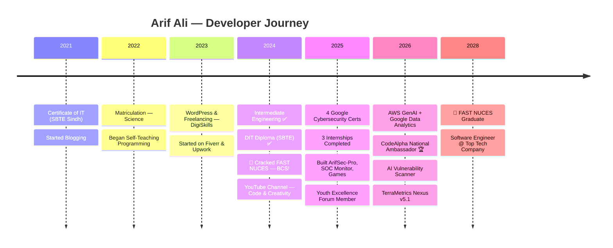

<div align="center">

<!-- Animated Header Banner -->


<!-- Typing SVG -->
[](https://git.io/typing-svg)

<!-- Visitor Badge + Profile Views -->
<p>
  
  
  
  
</p>

<!-- Social Links -->
<p>
  <a href="https://www.linkedin.com/in/arif-ali-23a38032a/" target="_blank">
    
  </a>
  <a href="https://github.com/ArifAli8866" target="_blank">
    
  </a>
  <a href="https://www.instagram.com/arifali.2007/" target="_blank">
    
  </a>
  <a href="https://arifali8866.github.io" target="_blank">
    
  </a>
</p>

</div>

---

<!-- About Me Section -->


## 🧑‍💻 About Me

```python
class ArifAli:
    def __init__(self):
        self.name        = "Arif Ali"
        self.university  = "FAST NUCES (BCS 2024–2028)"
        self.location    = "Sindh, Pakistan 🇵🇰"
        self.role        = "CS Student & Developer"
        self.ambassador  = "CodeAlpha National Ambassador 🟢"

    @property
    def skills(self):
        return {
            "languages" : ["C++", "Python", "JavaScript", "Java"],
            "web"       : ["HTML/CSS", "WordPress", "Firebase", "Tailwind"],
            "security"  : ["Kali Linux", "OSINT", "Network Sec", "Ethical Hacking"],
            "tools"     : ["Git", "AWS", "SQL", "Linux", "Bash", "SFML"],
        }

    @property
    def currently(self):
        return [
            "📚 3rd Semester at FAST NUCES",
            "🏆 National Ambassador @ CodeAlpha",
            "🔐 Building security tools & AI projects",
            "📜 13+ International Certifications",
            "🚀 15+ Real-world Projects",
        ]

    def say_hi(self):
        print("Thanks for visiting! Let's build something amazing 🚀")

me = ArifAli()
me.say_hi()
```

<br clear="right"/>

---

## 📊 GitHub Statistics

<div align="center">


</div>

<!-- Activity Graph -->
<div align="center">

</div>

---

## 🏆 GitHub Trophies

<div align="center">

</div>

---

## 🛠️ Tech Stack & Tools

<div align="center">

**💻 Programming Languages**


**🌐 Web Development**


**🔐 Cybersecurity**


**☁️ Cloud & Tools**


</div>

---

## 💼 Experience & Internships

<div align="center">

| 🏢 Company | 🎯 Role | 📅 Period | 🔰 Status |
|:---:|:---:|:---:|:---:|
| **CodeAlpha** | National Ambassador Intern | Mar 2026 – Present | 🟢 **Active** |
| **Trillet AI** | AI Voice Agent Developer | Mar 2025 | ✅ Completed |
| **Encryptix** | Cloud Computing Intern | May – Jun 2025 | ✅ Completed |
| **Codveda Technologies** | Web Development Intern | Apr – May 2025 | ✅ Completed |
| **CodeAlpha** | C++ Developer Intern | Mar – Apr 2025 | ✅ Completed |
| **Fiverr** | Freelance Developer | Jan 2024 – Present | 🟢 **Active** |
| **Upwork** | Freelance Developer | Jan 2024 – Present | 🟢 **Active** |

</div>

---

## 🚀 Featured Projects

<div align="center">

<a href="https://github.com/ArifAli8866/TerraMetrics-Nexus">
  
</a>
<a href="https://github.com/ArifAli8866/ArifSec-Pro">
  
</a>
<a href="https://github.com/ArifAli8866/ai-vuln-scanner">
  
</a>
<a href="https://github.com/ArifAli8866/fast-nu-merit-calculator">
  
</a>
<a href="https://github.com/ArifAli8866/linux-soc-monitor">
  
</a>
<a href="https://github.com/ArifAli8866/eid-mubarak-wishes">
  
</a>

</div>

---

## 📜 Certifications

<div align="center">

| 🏅 Certificate | 🏢 Issuer | 📅 Date |
|:---|:---:|:---:|
| 🤖 AWS Educate – Introduction to Generative AI | **Amazon Web Services** | Mar 2026 |
| 📊 Foundations: Data, Data, Everywhere | **Google** | Feb 2026 |
| 🔐 AI Security & Governance Certification | **Securiti AI** | Jan 2026 |
| 🐧 Tools of the Trade: Linux and SQL | **Google** | Jan 2026 |
| ⌨️ Typing Speed – 120 WPM | **TypingTest.me** | Jan 2026 |
| ☁️ AWS Solutions Architecture Job Simulation | **Forage × AWS** | Aug 2025 |
| 🌐 Connect & Protect: Networks and Network Security | **Google** | Jun 2025 |
| 🛡️ Play It Safe: Manage Security Risks | **Google** | Jun 2025 |
| 🔒 Foundations of Cybersecurity | **Google** | Jun 2025 |
| 💻 Diploma in Information Technology (DIT) | **SBTE Sindh** | May 2024 |
| 💼 Freelancing | **DigiSkills Pakistan** | Oct 2023 |
| 🌍 WordPress Development | **DigiSkills Pakistan** | Jul 2023 |
| 🖥️ Certificate of Information Technology | **SBTE Sindh** | Jan 2021 |

</div>

---

## 📈 Skill Proficiency

```
C++              ████████████████████░  95%
HTML / CSS       ██████████████████░░░  92%
JavaScript       █████████████████░░░░  88%
WordPress        █████████████████░░░░  88%
Python           █████████████████░░░░  85%
Linux / Kali     ████████████████░░░░░  82%
Network Security ███████████████░░░░░░  78%
Cybersecurity    ███████████████░░░░░░  78%
Networking       ███████████████░░░░░░  75%
Firebase         ██████████████░░░░░░░  72%
Ethical Hacking  ██████████████░░░░░░░  72%
Java             ██████████████░░░░░░░  70%
```

---

## 🎓 Education

<div align="center">

```
┌─────────────────────────────────────────────────────────────┐
│  🏛️  FAST National University of Computer & Emerging Sciences │
│  📚  Bachelor of Computer Science (BCS)                      │
│  📅  2024 – 2028  |  ✅ 3 Semesters Completed               │
│  📍  Pakistan  |  🎯 Focus: Programming, DSA, Cybersecurity  │
└─────────────────────────────────────────────────────────────┘

┌──────────────────────────────────────────────────────────────┐
│  🏫  Govt. Higher Secondary School Umer Daho Sarhad          │
│  📚  Intermediate – Engineering                              │
│  📅  2022 – 2024  |  ✅ Completed                            │
└──────────────────────────────────────────────────────────────┘

┌──────────────────────────────────────────────────────────────┐
│  🏫  Govt. High School Umer Daho Sarhad                      │
│  📚  Matriculation – Science                                 │
│  📅  2021 – 2022  |  ✅ Completed                            │
└──────────────────────────────────────────────────────────────┘
```

</div>

---

## 🌟 My Journey at a Glance

<div align="center">



</div>

---

## 📊 Coding Stats

<div align="center">

<!--START_SECTION:waka-->


<!--END_SECTION:waka-->


</div>

---

## 🔥 Current Focus

<div align="center">

```
╔══════════════════════════════════════════════════════════════╗
║                    🎯 CURRENTLY WORKING ON                   ║
╠══════════════════════════════════════════════════════════════╣
║  🤖  AI-integrated web applications & dashboards            ║
║  🔐  Advanced cybersecurity tools & OSINT frameworks        ║
║  ☁️   AWS Cloud architecture & serverless projects           ║
║  🎮  C++ game development with SFML engine                  ║
║  📊  Data analytics & visualization projects                ║
║  🌐  Full-stack web development (HTML/CSS/JS)               ║
╠══════════════════════════════════════════════════════════════╣
║                   📚 CURRENTLY LEARNING                      ║
╠══════════════════════════════════════════════════════════════╣
║  🧠  Data Structures & Algorithms (FAST NUCES)              ║
║  🔬  Machine Learning fundamentals                          ║
║  🛡️   Advanced network penetration testing                   ║
║  🗄️   Database Management Systems                            ║
╚══════════════════════════════════════════════════════════════╝
```

</div>

---

## 🎯 Dream Companies

<div align="center">


</div>

---

## 🐍 Contribution Snake

<div align="center">
<picture>
  <source media="(prefers-color-scheme: dark)" srcset="https://raw.githubusercontent.com/ArifAli8866/ArifAli8866/output/github-contribution-grid-snake-dark.svg"/>
  <source media="(prefers-color-scheme: light)" srcset="https://raw.githubusercontent.com/ArifAli8866/ArifAli8866/output/github-contribution-grid-snake.svg"/>
  
</picture>
</div>

> **Note:** To enable the snake animation, create a GitHub Actions workflow in your profile repo (`ArifAli8866/ArifAli8866`). See setup instructions below.

---

## 💬 Random Dev Quote

<div align="center">


</div>

---

## 📫 Connect With Me

<div align="center">

<a href="https://www.linkedin.com/in/arif-ali-23a38032a/">
  
</a>
<a href="https://github.com/ArifAli8866">
  
</a>
<a href="https://www.instagram.com/arifali.2007/">
  
</a>
<a href="https://arifali8866.github.io">
  
</a>

<br/><br/>

**📧 Open for:** Internships · Freelance · Collaborations · Open Source

</div>

---

<!-- Footer Wave -->


<div align="center">

**⭐ Star my repos if you find them useful!**

*Made with ❤️ by Arif Ali — FAST NUCES, Pakistan 🇵🇰*

</div>
